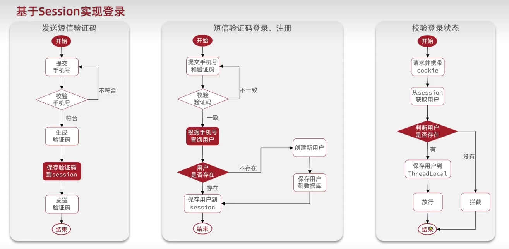
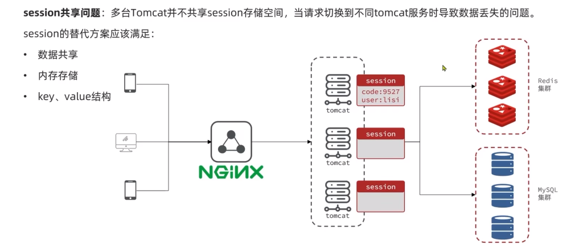
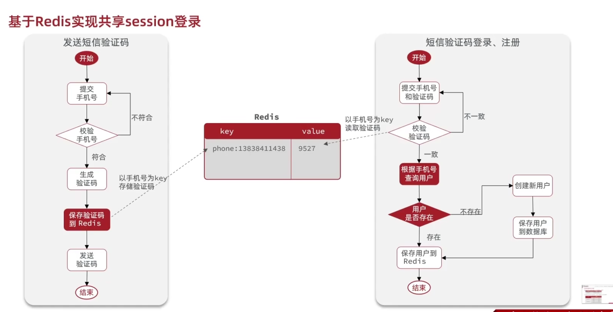
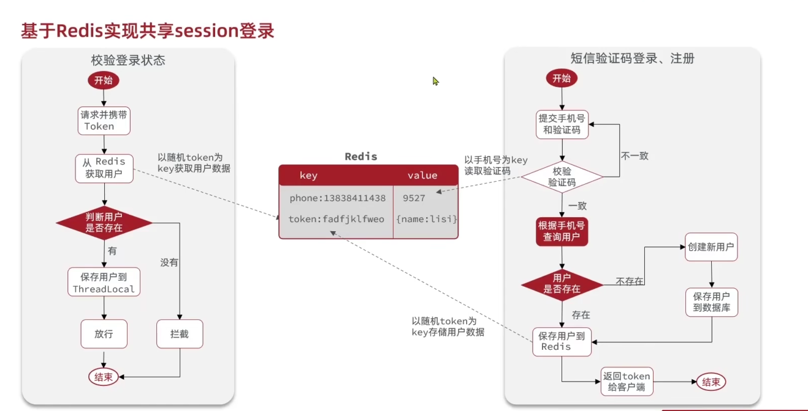

## Session

session在网络应用中称为“会话控制”，是服务器为了保存用户状态而创建的一个特殊的对象。简而言之，session就是一个对象，用于存储信息。 

### 基于Session登录

### 登录验证功能

### 集群的session共享问题

`tomcat`: Tomcat是常见的免费的web服务器。 简单而言就是，你写的页面只能自己访问，**别人不能远程访问你写的页面**，Tomcat就是**提供能够让别人访问自己写的页面的一个程序**

`nginx`: nginx是由俄罗斯人发明的一款高性能的web服务器，它同早期的Apache，IIS，Lighttpd等都具有web服务器的功能，能够发布网站代码等资源，为用户提供信息资讯。但是nginx的功能不单单只是做为web服务器，它还可以用来做反向代理和负载均衡服务器，并且整体性能非常强大，在web前端服务器目前是企业的首选。

此问题主要在于，如果基于session实现登录功能，客户端发送登录后发送携带session文件的信息给nginx，nginx将其负载均衡给tomcat，这就可能会造成对于不同的tomcat服务而言的数据丢失问题，虽然可以通过拷贝，将数据拷贝到所有的tomcat上，但是因为拷贝耗时且耗内存。

那么，很显然，对于session的替代方案，我们很显然需要满足以下特点：

1. 数据共享
2. 内存存储
3. k-v结构

很显然，redis完美满足以上特点。

### 基于Redis实现贡献session存储

保存用户的登录信息，我们可以采用String结构，以Json字符串的形式来保存，或者也可以采用Hash结构将对象中的每个字段独立存储。

在上述中，我们使用手机号作为key值进行登录，虽然可以满足功能，但是实际上是不太合适的。

正确的方式应该是后端校验用户成功之后，将用户保存到redis，并且返回token（令牌，这里的话简单理解成一串加密字符串就好）给前端，保存在对应的浏览器上，下次校验登录状态时，客户端请求并鞋带token，以token作为key获取用户数据，判断用户是否存在，以此判断放行或者是拦截。

