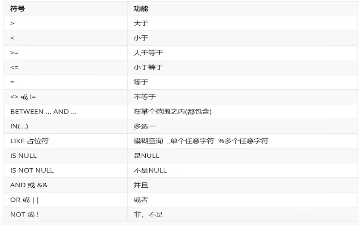
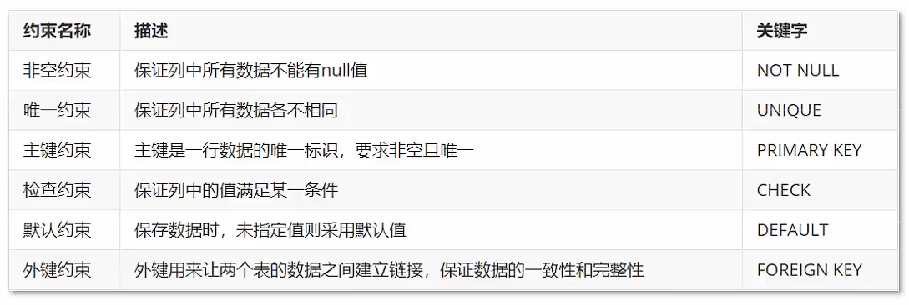

# **SQl数据类型**

## **数值类型**

* tinyint	1byte	小整数值
* smallint	2bytes	大整数值
* mediumint	3bytes	大整数值
* int/integer	4bytes	大整数值
* bigint	8bytes	极大整数值
* float		4bytes	 单精度浮点数值
* double	8bytes	双精度浮点数值
* decimal            	小数值；

## **日期和时间类型**

* date		3		日期值
* time		3		时间或持续时间
* year		1		年份值
* datetime	8		混合日期和时间值
* timestamp	4	混合日期和时间值，时间戳

## **字符串类型**

* char 	0-255byes		定长字符串
* varchar	0-65535bytes		变长字符串
* tinyblob	0-255byes		不超过255个字符串的二进制字符串
* tinytext 	0-255byes		短文本字符串
* blob		0-65535bytes		二进制形式的长文本数据
* text		0-65535bytes		长文本数据
* mediumblob	0-16777215bytes	二进制形式的中等长度文本数据
* mediumtext	0-16777215bytes	中等长度文本数据
* longblob		0-4294967295bytes	二进制形式的极大本文数据
* longtext		0-4294967295bytes	极大文本数据

# **SQL分类:**

1.DDL数据定义语言，用来定义数据库对象：数据库，表，列等。

2.DML数据操作语言，用来对数据库中的表的数据进行增删改操作

3.DQL数据查询语言，用来查询数据库中的表的记录（数据）

4.DCL数据控制语言，用来定义数据库的访问权限和安全级别，以及创建用户。

## **DDL-操作数据库**

### **查询**

```mysql
show databases;  #查询
```

### **创建**

```mysql
create database 数据库名称;  #创建数据库

create database if not exists 数据库名称； #如果不存在就创建数据库
```

### **删除**

```mysql
drop database 数据库名称; #删除数据库

drop database if exists 数据库名称; #如果数据库存在，则删除
```

### **使用**

```mysql
use 数据库名称; #使用数据库

select database(); #查看当前使用的数据库
```

## **DDL-操作表**

### **查询表**

```mysql
show tables;#查询当前数据库下所有表的名称

desc 表名称;#查询表结构
```

### **创建表**

```mysql
create table 表明(    字段名1 数据类型1,    字段名2 数据类型2,    ...    字段名n，数据类型n );
```

### **删除表**

```mysql
drop table 表名;

drop table if exists 表名; #如果存在就删除
```

### **修改表**

```mysql
alter table 表名 rename to 新表名;    修改表名

alter table 表名 add 列名 数据类型;    添加一列数据;

alter table 表名 modify 列名 新数据类型;    修改某一列的数据类型

alter table 表名 change 列名 新列名 新数据类型;     修改列名和数据类型

alter table 表名 drop 列名; 删除列;
```

## **DML**

### **添加数据**

```mysql
insert into 表名(列名1，列明2...) values(值1,值2...) #给指定列添加数据  

insert into 表名 values(值1,值2...)  #给全部列添加数据  

insert into 表名(列名1，列明2...) values(值1,值2...),(值1,值2...),(值1,值2...)...; 

insert into 表名 values(值1,值2...),(值1,值2...),(值1,值2...)...; #批量增加数据
```

### **修改数据**

```mysql
update 表名 set 列名1=值1, 列名2=值2, ...[where 条件]; #修改表数据
```

### **删除数据**

```mysql
delete from 表名 [where 条件];#删除数据
```

## **DQL**

### **查询语法**

```mysql
select    字段1  from    表名列表  where    条件列表 group by    分组字段 having    分组后条件 order by    排序字段 limit    分页限定
```

### **基础查询**

```mysql
1.查询多个字段 select 字段列表 from 表名; select * from 表名;#查询所有数据 星号意味着选择所有列  

2.去除重复记录 select distinct 字段列表 from 表名;  

3.起别名 as:
```

### **模糊查寻**

```mysql
select* from 表名 where 列名 like '%String%';
```

### **条件查询**

```mysql
select 字段列表 from 表名 where 条件;
```

#### **条件**

​    

### **排序查询**

```mysql
select 字段列表 from 表名 order by 排序字段名1[排序方式1]，排序字段名2[排序方式2]...; #排序查询语法 
/* 排序方式 ASC:升序排序 DESC:降序排序 */
```


### **分组查询**

#### **聚合函数**

##### **分类**

* count(列名) 统计数量 
* max(列名)  最大值 
* min(列名)  最小值 
* sum(列名)  求和 
* avg(列名)   求平均值

##### **语法**

```mysql
select 聚合函数名(列名) from 表;
```

#### **分组查询语法**

```mysql
SELECT column_name, function(column_name)
FROM table_name
WHERE column_name operator value
GROUP BY column_name;
```

### 分页查询

```mysql
select 字段列表 from 表名 limit 起始索引,查询条目数;
```

### 并集 union

MySQL UNION 操作符用于连接两个以上的 SELECT 语句的结果组合到一个结果集合中。多个 SELECT 语句会删除重复的数据。

```mysql
SELECT expression1, expression2, ... expression_n
FROM tables
[WHERE conditions]
UNION [ALL | DISTINCT]
SELECT expression1, expression2, ... expression_n
FROM tables
[WHERE conditions];
```

- **expression1, expression2, ... expression_n**: 要检索的列。
- **tables:** 要检索的数据表。
- **WHERE conditions:** 可选， 检索条件。
- **DISTINCT:** 可选，删除结果集中重复的数据。默认情况下 UNION 操作符已经删除了重复数据，所以 DISTINCT 修饰符对结果没啥影响。
- **ALL:** 可选，返回所有结果集，包含重复数据。

# **约束**

## **概念**

约束是作用于表中列上的规则，用于限制加入表的数据。

约束的存在保证了数据库中数据的正确性，有效性和完整性。

## **分类**

​    

## **语法**

```mysql
#添加约束 
create table 表名(   
    列名 数据类型 约束关键字,#通过给字段添加 AUTO_INCREMENT 属性来实现主键自增长    
    ... 
) 

alter table 表名 modify 字段名 数据类型 约束关键字;  


删除约束 
alter table 表名 modify 字段名 数据类型;
```

## **外键约束**

前面的各种约束都差不多，这里着重讲解外键约束

外键用来让两个表之间的数据建立链接，保证数据的一致性和完整性。

### **语法**

外键的使用：

外键字段不能为该表的主键；

外键字段参考字段必须为参考表的主键(primary key)。

```mysql
#添加外键约束 
create table 表名(    
    列名 数据类型,
    ...    
    [constraint] [外键名称] foreign key(外键列名) references 主表(主表列名) 
) 

alter table 表名 add constraint 外键名称 foreign key (外键字段名称) references 主表名称(主表列名称) 

#删除外键约束 
alter table 表名 drop foreign key 外键名称;
```

# **数据库设计**

## **概念**

数据库设计就是根据业务系统的具体需求，结合我们所选用的DBMS,为这个业务构建出最佳的数据存储结构

建立数据库中的表结构以及表与表之间的关联关系的过程。

## **设计步骤**

​    

## **表关系**

* 一对一

* 一对多

* 多对多

### **多表关系实现**

#### **一对一**

一对一关系多用于表拆分，将一个实体中经常使用的字段放一张表，不经常使用的放另一张表，用于提升查询性能


#### **一对多**

在多的一方建立外键，指向一的一方的主键。


#### **多对多**

建立第三张中间表，中间表中至少包含两个外键，分别关联双方的主键。


# **多表查询**

## **基础概念:**

笛卡尔积：有两个集合AB，取AB的所有组合情况。

多表查询：从多张表中查询数据。


## 连接查询：

内连接：

* 相当于查询A B的交集数据；


外连接：

* 左外连接：相当于查询A表所有数据和交集部分数据；

* 右外连接：相当于查询B表所有数据和交集部分数据；

子查询。

```mysql
select * from 表1,表2;  
//可以达到目的，但是会产生笛卡尔积，产生很多无用数据 

select * from 表1,表2 where 条件;  
//where筛选
```

### **内连接**

相当于查询两集合A B的交集数据

```mysql
//隐式内连接 
select 字段名称 from 表1,表2... where 条件; 

//显式内连接 
select 字段名称 from 表1 [inner] join 表2 on 条件;
```

### **外连接**

* 左外连接：相当于查询A表所有数据和交集部分数据；

* 右外连接：相当于查询B表所有数据和交集部分数据；

```mysql
//左外连接 
select 字段名称 from 表1 left [outer] join 表2 on 条件; 

//右外连接 
select 字段名称 from 表1 right [outer] join 表2 on 条件;
```

## **子查询**

概念：

查询中嵌套查询，则称嵌套查询为子查询。

子查询根据查询结果不同，作用不同：

- 单行单列
- 多行单列
- 多行多列

```mysql
单行单列 
select 字段列表 from 表 where 字段名=(子查询); 

多行单列 
select 字段列表 from 表 where 字段名 in (子查询); 

多行多列 
select 字段列表 from (子查询) where 条件;
```

# **事务**

## **简介**

- 数据库的事务是一种机制，一个操作序列，包含了一组数据库操作命令。
- 十五把所有的命令作为一个整体一起向系统提交或者撤销操作请求，即这一组数据库命令要么同时成功，要么同时失败。
- 事务是一个不可分割的工作逻辑单元。

##  **基础语法：**

```mysql
--开启事务 start transaction; 或者 begin; 
--提交事务 commit; 
--回滚事务 rollback;
```

## **事务的四大特征：**

- 原子性：事务是不可分割的最小操作单位，要么同时成功，要么同时失败。
- 一致性：事务完成时，必须使所有的数据都保持一致状态
- 隔离性：多个事物之间，操作的可见性
- 持久性：事务一旦提交或者回滚，它对数据库中的数据的改变就是永久的。

## **MySQL事务默认提交**

```mysql
--查看事务的默认提交方式 
select @@autocommit;
--1自动提交 0手动提交 

--修改事务提交方式 
set @@autocommit =0;
```

